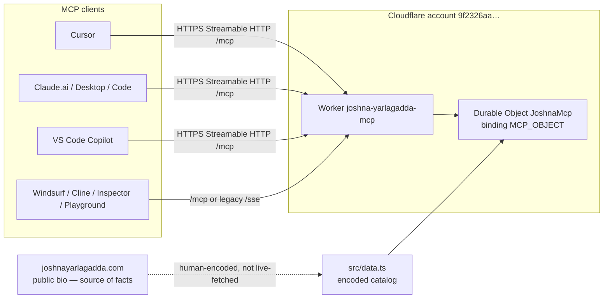
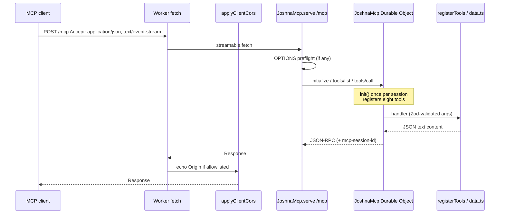

# Architecture — Joshna Yarlagadda remote MCP

This document describes the **implemented** v1 system: a public, authless Cloudflare Worker that exposes eight read-only MCP tools at path `/mcp`. It is the living example of the “Build an MCP for your product” offering.

Related:

- Client attach steps: [SETUP.md](SETUP.md)
- Operator runbook: [README.md](README.md)
- Live endpoint: `https://joshna-yarlagadda-mcp.bhaskar-itm.workers.dev/mcp`
- Public facts: https://joshnayarlagadda.com

---

## 1. Purpose and constraints

| Decision | Why |
| --- | --- |
| Remote MCP on Cloudflare Workers | Assistants (Cursor, Claude, Copilot, …) attach over HTTPS without a local process. |
| Path `/mcp` | Canonical public URL is `https://joshnayarlagadda.com/mcp` (DNS later). Same path on `workers.dev`. |
| `McpAgent` + Durable Object | Matches `cloudflare/ai/demos/remote-mcp-authless` (sessionful Streamable HTTP). |
| Authless v1 | Every byte is already on the public site. No OAuth, no API keys, no secrets in git. |
| Static catalog | Tools work offline. Do not invent metrics or jobs. |
| Task-shaped tools | `verb_noun` + Zod. No admin/destroy tools. |

v1 is **read-only**. Write tools, product-API wrapping, and two-layer auth are described in `get_mcp_offering` as a *client* offering — they are not implemented on this Worker.

---

## 2. System context



Clients never receive unpublished data. Anthropic’s Claude connectors call the Worker from Anthropic’s cloud; Cursor and most IDEs call it from the user’s machine (native HTTP) or via a local `mcp-remote` stdio bridge.

---

## 3. Runtime topology

One Worker script, one Durable Object class.

```
Internet
   │
   ▼
joshna-yarlagadda-mcp.bhaskar-itm.workers.dev
   │
   ├─ GET /            → landing HTML (humans)
   ├─ *  /mcp[/…]      → JoshnaMcp.serve()     Streamable HTTP
   ├─ *  /sse[/…]      → JoshnaMcp.serveSSE()  legacy SSE
   └─ else             → 404 text
         │
         ▼
   Durable Object JoshnaMcp  (env.MCP_OBJECT)
         │
         ├─ McpServer name=joshna-yarlagadda
         └─ registerTools()  → 8 server.tool() handlers
                │
                └─ src/data.ts  (static JSON payloads)
```

| Component | Binding / name | Role |
| --- | --- | --- |
| Worker entry | `src/index.ts` default export | Route, CORS wrap, landing page |
| MCP class | `JoshnaMcp extends McpAgent` | Session + tool registration |
| DO binding | `MCP_OBJECT` → `JoshnaMcp` | Required by `McpAgent.serve` |
| DO storage | SQLite class migration `v1` | Session state for Streamable HTTP |
| Compatibility | `nodejs_compat`, date `2026-07-02` | Agents SDK / MCP SDK on Workers |

`wrangler.toml` does **not** attach `joshnayarlagadda.com` yet. The Worker already serves `/mcp` on any hostname; a later route/zone step binds the custom domain.

---

## 4. Request path (Streamable HTTP)



Session header: after `initialize`, clients send `mcp-session-id` on subsequent calls. That is how the Worker pins the client to one Durable Object instance.

Legacy Inspector that only speaks SSE uses `GET /sse` then posts messages to `/sse/message` (handled by `serveSSE`).

A browser `GET /mcp` is **not** a page. It returns a protocol error (for example “Client must accept text/event-stream”). Humans use `GET /`.

---

## 5. Module map

```
src/index.ts      Worker router + JoshnaMcp class
src/tools.ts      server.tool() + Zod schemas (no extra tools)
src/data.ts       Public professional catalog (source of truth)
src/respond.ts    { content: [{ type: "text", text: JSON }] }
src/clients.ts    Live URL, CORS defaults, Claude Origin echo
src/landing.ts    GET / HTML
scripts/smoke-mcp.ts   initialize + tools/list against a running URL
test/*.test.ts    Catalog fixtures, tool registration, Origin allowlist
```

Dependency direction is one-way: `index` → `tools` → `data` / `respond`. `clients` is only used by the Worker wrapper. Tests import `data` and `tools` without spinning a Worker.

Runtime packages:

- `agents` — `McpAgent`, `serve`, `serveSSE`
- `@modelcontextprotocol/sdk` — `McpServer`, `server.tool()`
- `zod` — tool input schemas

---

## 6. Tool layer

Tools are registered in `JoshnaMcp.init()` via `registerTools(this.server)`.

| Name | Inputs | Data |
| --- | --- | --- |
| `get_profile` | none | `PROFILE` |
| `list_services` | none | `SERVICES` |
| `list_industries` | none | `INDUSTRIES` |
| `list_outcomes` | none | `OUTCOMES` (four public-bio metrics only) |
| `list_experience` | optional `company` string | `EXPERIENCE` substring filter |
| `list_certifications` | none | credentials + education |
| `get_contact` | none | public email / LinkedIn / mobile / Atlanta |
| `get_mcp_offering` | none | offering phases + Claude attach notes |

Every handler returns MCP `text` content that is `JSON.stringify` of a typed object (`jsonResult`). Clients parse JSON from the text field.

There is no dispatcher `switch` over tool names; each tool is registered independently. Adding a tool requires a new `server.tool()` call, a catalog entry, and a fixture — do not add admin/destroy.

---

## 7. Data architecture

```
joshnayarlagadda.com  ──human encode──►  src/data.ts  ──read──►  tools
                                              ▲
                                              └── tests assert published facts
```

- **Source of truth at runtime:** `src/data.ts`, compiled into the Worker bundle.
- **Not implemented:** live HTML scrape of the site. A fetch fallback was considered and dropped so tools stay deterministic and offline-safe.
- **Provenance:** each payload includes `SOURCE` (`site`, `mcp`, note). Outcomes cite “Public bio on joshnayarlagadda.com”.
- **PII rule:** `get_contact` returns only fields the public site already shows.

Updating a role, metric, or cert is a catalog edit + test change + deploy. Do not invent numbers to “fill in” a client question.

---

## 8. Auth, CORS, and trust

```
v1 this Worker     ──────────────────────────────────────────
  Layer 1 identity   none (public URL)
  Layer 2 authz      none (all eight tools for every caller)
  Transport          HTTPS on workers.dev (Cloudflare edge TLS)

Client-product MCP (described, not built here)
  Layer 1            OAuth / Access / product bearer
  Layer 2            tool allowlists, scoped tokens
```

CORS:

1. `McpAgent.serve(..., { corsOptions: MCP_CORS })` — default `Access-Control-Allow-Origin: *`, methods GET/POST/DELETE/OPTIONS, headers include `mcp-session-id` and `mcp-protocol-version`.
2. `applyClientCors` — if `Origin` is an allowlisted Claude / Cursor / localhost / `workers.dev` host, the response echoes that Origin and `Vary: Origin`. Requests **without** `Origin` (Claude’s cloud connector, curl, Inspector proxy) are unchanged and allowed.

No `/.well-known/oauth-protected-resource` is published, so Claude custom connectors should detect **Authentication: None**.

Trust boundary: anyone who knows the URL can call every tool. That is intentional for v1. Do not put unpublished diligence, private emails, or product credentials in the catalog.

---

## 9. Deployment architecture

```
git main
  │
  ├─ GitHub  cybersec559/joshna-yarlagadda-mcp
  └─ wrangler deploy
        │
        ▼
  Account Bhaskar.itm@gmail.com  (9f2326aa1f2a711047b35450de854eb8)
        │
        ├─ workers.dev subdomain   bhaskar-itm   (account-level)
        ├─ Worker                  joshna-yarlagadda-mcp
        └─ DO class                JoshnaMcp (SQLite v1)
              │
              └─ https://joshna-yarlagadda-mcp.bhaskar-itm.workers.dev/mcp
```

Later DNS (not enabled in `wrangler.toml`):

```
joshnayarlagadda.com          → existing marketing site
joshnayarlagadda.com/mcp*     → this Worker (route only)
```

Local: `wrangler dev --port 8788` binds `0.0.0.0:8788` with the same DO binding in local mode. No Cloudflare credentials are required to develop.

Observability is on (`[observability] enabled = true`) for Worker logs in the dashboard.

---

## 10. Verification architecture

| Layer | What |
| --- | --- |
| Catalog fixtures | `test/catalog.test.ts` — facts, eight tool names, no admin/destroy |
| Registration | `test/tools.test.ts` — `McpServer` + `registerTools` |
| CORS helper | `test/clients.test.ts` — Claude Origin allow / deny |
| Protocol smoke | `scripts/smoke-mcp.ts` — `initialize` + `tools/list` against `MCP_URL` |
| Typecheck | `tsc --noEmit` |
| Bundle | `wrangler deploy --dry-run` (DO binding visible) |

CI is not required for v1. Smoke against production:

`MCP_URL=https://joshna-yarlagadda-mcp.bhaskar-itm.workers.dev/mcp npm run smoke`

---

## 11. Failure modes

| Failure | Behavior |
| --- | --- |
| Unknown path | 404, points callers at `/mcp` |
| Browser GET `/mcp` | MCP protocol error (wrong Accept) |
| Invalid `company` filter | Empty `experience` array, `filtered: true` |
| DO / session lost | Client re-`initialize`s; tools are stateless so no user data is lost |
| Site joshnayarlagadda.com down | Tools still succeed (static catalog) |
| Custom domain not routed | Use `workers.dev` URL |

There is no retry against a product API and no cache layer — responses are in-memory constants.

---

## 12. Evolution (out of scope for v1 code)

| Change | How it fits this design |
| --- | --- |
| Attach `joshnayarlagadda.com/mcp` | Uncomment `[[routes]]` or dashboard route. No tool changes. |
| Live site refresh | Optional Worker fetch + parse, with catalog as fallback. Must not invent fields when fetch fails. |
| Product-API MCP for a client | New Worker (or new tools) + two-layer auth. Keep this public MCP authless. |
| Stateless `createMcpHandler` | Possible later; today `McpAgent` + DO is the shipped path. |

---

## 13. What this architecture is not

- Not an OAuth resource server
- Not a scrape proxy
- Not a database
- Not a second copy of the marketing site
- Not a multi-tenant product MCP (that is the *offering*, documented in `get_mcp_offering`)
